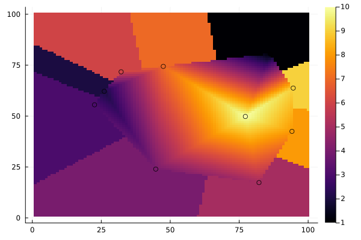

# Barycentric Interpolation
## Installation
``` julia
julia> ] add https://github.com/LukasHasf/SimplexInterpolation
```
## Usage
``` julia
using SimplexInterpolation
xs = rand(10)
ys = rand(10)
zs = rand(10)
itp_simplex = SimplexInterpolation.SimplexInterpolator(xs, ys, zs)
x_query = 0.5
y_query = 0.5
itp_value = interpolate(itp_simplex, x_query, y_query)
```
## Example interpolation

